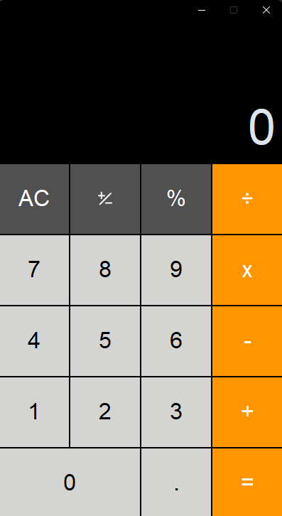

# Calculator App

A simple and elegant calculator built with Python using `customtkinter`.



## Features

- Basic arithmetic operations: addition, subtraction, multiplication, and division.
- Clear (AC), sign change (±), and percentage (%) functions.
- Modern and clean user interface.
- Responsive and easy-to-use design.

## How to Run

1. Make sure you have Python installed.
2. Install the required library if you haven't already:

```bash
pip install customtkinter
```

3. Run the application:

```bash
python calculator.py
```

## Screenshot

The app looks like this:


## Author

Created by **Basem-2004**